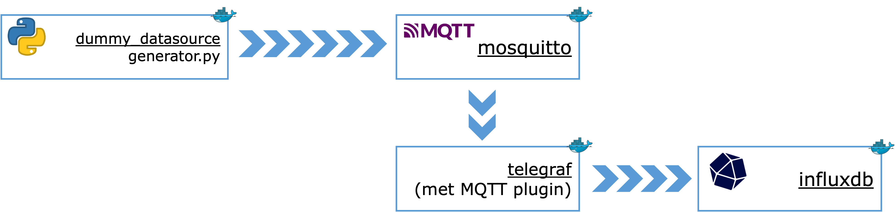
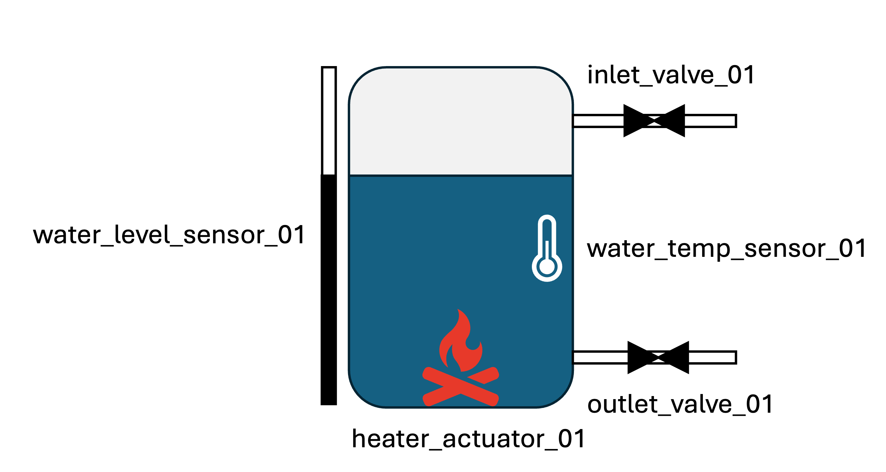

# Time series database oefeningen

## Setup

1. Ga in een Command prompt naar de folder waarin deze README staat.

> Navigeren naar een folder kan je doen met het commando `cd`.
> Tip: gebruik de Tab-toets om het pad aan te vullen.
> 
> Bijvoorbeeld, als je naar de folder `C:\Users\me\Downloads\03-timeseries` wil gaan, 
> en je staat al in `C:\Users\me`, dan typ je `cd Downloads\03-timeseries`.
> Het volstaat waarschijnlijk om `cd Dow<tab>\03<tab>` te typen.

2. Start alle Docker containers via
`docker compose up --build` in de folder van deze README. Dit start 4 containers die met mekaar communiceren, namelijk
- Dummy datasource (een Python-script dat data genereert en verstuurt via MQTT)
- Mosquitto (een lokale MQTT broker)
- Telegraf (een agent om data uit MQTT in te voegen in de database)
- InfluxDB (de time series database)



> Het --build argument zorgt ervoor dat, als je de python-code van de generator aanpast, de image elke opnieuw gebouwd wordt voor de container gestart wordt.

> Als je later opnieuw wil beginnen met de originele database,
> - stop je de database (Ctrl-C)
> - verwijder je de folder `influxdb2_data` die aangemaakt wordt
> - start je de database opnieuw (`docker compose up`)
> De originele database wordt dan opnieuw aangemaakt.

## Oefeningen

### Oefening 1

De data-generator simuleert een systeem om water te verwarmen.



Bekijk de Python-broncode van de [data-generator](./dummy_datasource/generator.py). Zorg dat je (minstens in grote lijnen) begrijpt wat er gebeurt.

Hoeveel sensoren en actuatoren zijn er die data aanleveren?

### Oefening 2

Bekijk het bestand [`telegraf.conf`](telegraf.conf) in deze folder (dat kan met [VS Code](https://code.visualstudio.com/), PyCharm, of een andere gewone teksteditor). Wat wordt er in dit bestand geconfigureerd?
Kan je terugvinden hoe de data uit MQTT omgezet wordt in fields en tags?

### Oefening 3

1. Surf naar [http://localhost:8086](http://localhost:8086) en login als `admin` met wachtwoord `password`.
2. Zet 'View Raw Data' aan.
3. Ga naar de 'Data Explorer' tab, en klik op 'SCRIPT EDITOR'.
4. Doe een query om alle data van de laatste 30 seconden te bekijken:
```flux
from(bucket: "timeseries")
|> range(start: -30s)
```

### Oefening 4

Hoeveel tabellen zitten er in het resultaat van oefening 3? (Kijk naar de eerste kolom in het resultaat)

### Oefening 5

Maak een query die de gemiddelde waarde van *alle sensoren* van de laatste 30 seconden teruggeeft.

### Oefening 6

Maak een query die, van de laatste 5 minuten in periodes van 30 seconden, de gemiddelde waarde van *alle sensoren* teruggeeft.

### Oefening 7

Maak een query die, van de laatste 5 minuten in periodes van 30 seconden, de gemiddelde temperatuur gemeten door `water_temp_sensor_01` in elk van die periodes teruggeeft.

### Oefening 8

Zet 'View Raw Data' uit. Je ziet nu het resultaat als een grafiek in plaats van als een tabel.

### Oefening 9

Maak een query (en grafiek) die het *moving average* van het waterniveau weergeeft, telkens gebaseerd op de laatste 10 metingen.

### Oefening 10

InfluxDB heeft ook een makkelijkere manier om queries te bouwen.
1. Klik op 'QUERY BUILDER'.
2. Kies 
    - bij FROM de **timeseries** bucket
    - een filter '_measurement' met waarde **factory**,
    - een filter 'type' met waarde **sensor**,
    - en een filter '_field' met waarde **value**.

    Zet verder ook
    - het klokje (naast 'SCRIPT EDITOR') op **Past 15m**,
    - 'Window period' (rechts) op **Custom 5s**,
    - en tenslotte 'Aggregate function' op **mean**.

3. Druk op submit en bekijk het resultaat.
4. Bedenk welke query je hier uitvoert. 
